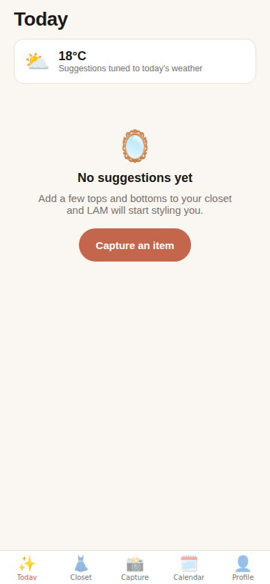
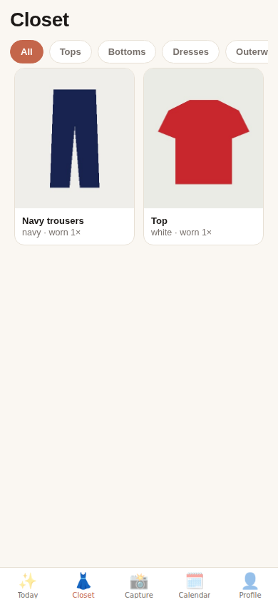
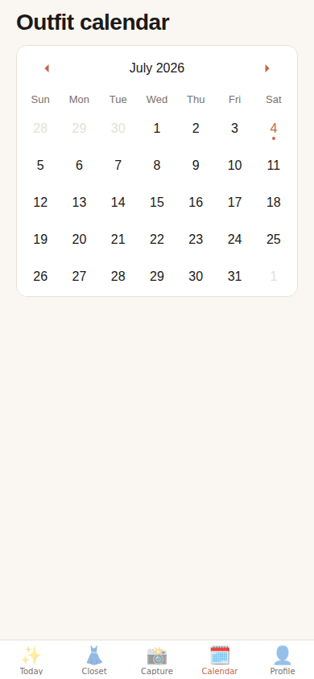
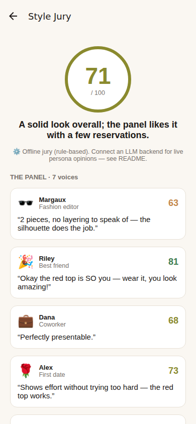
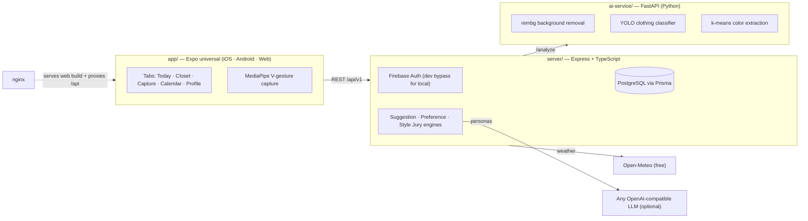

# LAM — Your AI Stylist & Digital Wardrobe

[](https://github.com/barab2002/LAM/actions/workflows/ci.yml)
[](LICENSE)

Point your camera at your clothes and LAM does the rest: hands-free capture, AI
tagging into a digital closet, weather-aware daily outfit suggestions that learn
your taste — and a **Style Jury** of simulated people who tell you what the
world will think of your fit.

One codebase, three platforms: **iOS · Android · Web** (mobile-first).

| Today | Closet | Calendar | Style Jury |
| --- | --- | --- | --- |
|  |  |  |  |

## Features

- ✌️ **Hands-free smart capture** — show the camera a "V" gesture (MediaPipe
  hand tracking) and a 3-second countdown fires the shutter. Manual shutter and
  self-timer everywhere.
- 🧺 **Auto-wardrobe & AI tagging** — every capture flows through background
  removal (rembg/u2net) → clothing classification (YOLO) → dominant-color
  extraction, landing pre-tagged in your closet.
- 🌦️ **Daily suggestions** — outfits scored by learned color preferences, your
  body shape, and the local forecast (Open-Meteo, no API key). Swipe right/left
  to teach the engine your taste.
- 🗓️ **Outfit calendar & anti-repeat** — every item tracks `wear_count` and
  `last_worn_date`; the calendar keeps your history and the engine never
  re-suggests a look worn in the last two weeks.
- 🧹 **Declutter insights** — never-worn and long-unworn items surface as
  candidates to archive.
- 🗣️ **Style Jury** — an agent-based opinion simulation: 7 personas (fashion
  editor, best friend, coworker, first date, gen-z kid, grandma, minimalist
  stylist) rate your outfit, read each other's takes in an opinion-dynamics
  round, and deliver a 0-100 score with a verdict on *what people will think*.

## Architecture



## Quick start (no accounts, no API keys)

Requirements: Docker + Node 20+.

```bash
git clone https://github.com/barab2002/LAM && cd LAM
cd app && npm install && npm run build:web && cd ..
docker compose up --build
```

Open **http://localhost:8080** — sign in with any email (dev-bypass mode),
allow the camera, capture your first garment.

> First AI request downloads u2net weights if they weren't cached at image
> build time; CPU tagging takes a few seconds per item.

## Local development

```bash
npm run setup                 # server + app deps, ai-service venv
cp server/.env.example server/.env
npm run db:migrate            # needs Postgres on :5432 (see CONTRIBUTING.md)

npm run dev:server            # API on :4000 (hot reload)
npm run dev:ai                # AI service on :8000 (hot reload)
npm run dev:app               # Expo — press w / i / a
```

| Root command | What it does |
| --- | --- |
| `npm test` | server (Jest + Supertest) · app (Jest) · ai-service (pytest) |
| `npm run typecheck` | TypeScript across server + app |
| `npm run build:web` | Static web bundle → `app/dist` |
| `npm run stack` | Web build + full docker stack on :8080 |

More in [CONTRIBUTING.md](CONTRIBUTING.md).

## Style Jury LLM backends (free or paid)

The jury speaks through **any OpenAI-compatible endpoint** — configure on the
server (`server/.env.example`):

| Backend | `LLM_BASE_URL` | Example `LLM_MODEL` | Cost |
| --- | --- | --- | --- |
| Ollama (local) | `http://localhost:11434/v1` | `llama3.2` | free |
| Groq | `https://api.groq.com/openai/v1` | `llama-3.3-70b-versatile` | free tier |
| OpenRouter | `https://openrouter.ai/api/v1` | `meta-llama/llama-3.3-70b-instruct:free` | free models |
| Gemini | `https://generativelanguage.googleapis.com/v1beta/openai` | `gemini-2.0-flash` | free tier |
| OpenAI / others | provider URL | any chat model | paid |

Set `LLM_VISION=true` only for multimodal models — the jury then sees the
actual outfit photos instead of just the tags.

**No backend configured?** The feature still works: a deterministic rule-based
jury scores the outfit using the suggestion engine (color harmony, learned
preferences, body shape) with per-persona template comments, labeled "offline
jury" in the UI — and it's the automatic fallback whenever the LLM endpoint
errors or times out.

How the simulation runs (`server/src/services/styleJuryService.ts`): round 1 —
each persona reacts independently; round 2 — personas read the panel and may
revise their score ±10 and reply (conformity/polarization dynamics); a report
agent then writes the two-sentence verdict, and the mean becomes the score.

## Firebase (production auth & storage)

Dev-bypass mode is for local development only. For real deployments:

1. Create a Firebase project; enable **Authentication → Email/Password** and
   **Cloud Storage**.
2. **Server**: create a service-account key and set
   `FIREBASE_SERVICE_ACCOUNT_JSON` (paste the JSON — Railway-friendly) or
   `FIREBASE_SERVICE_ACCOUNT_PATH`, plus `FIREBASE_STORAGE_BUCKET`; set
   `DEV_AUTH_BYPASS=false`.
3. **App**: copy the web-app config into `app/.env` as `EXPO_PUBLIC_FIREBASE_*`
   (see `app/.env.example`). With those set the app switches from dev-bypass to
   real Firebase auth automatically.

## Deploying to Railway

1. Create a Railway project from this repo and add the **PostgreSQL** plugin
   (injects `DATABASE_URL`).
2. Two services from the repo, both Dockerfile-detected:
   - **server** (root `server/`): set `AI_SERVICE_URL` (internal ai-service
     URL), `AI_SERVICE_SECRET`, Firebase vars, `PUBLIC_BASE_URL`, and the
     `LLM_*` vars if you want the live jury.
   - **ai-service** (root `ai-service/`): set `AI_SERVICE_SECRET`.
3. Publish the web app on any static host:
   `cd app && EXPO_PUBLIC_API_URL=https://<server-url> npm run build:web`, then
   deploy `app/dist`.

## Native builds & the gesture upgrade path

- **iOS/Android**: `cd app && npx expo prebuild && npx expo run:ios|android`
  (or EAS). Camera + self-timer capture, closet, swipe rating, jury, calendar
  and profile all work out of the box.
- **Web** has full hands-free V-gesture capture via MediaPipe's browser SDK.
- **Native hands-free** (optional upgrade): the V-gesture classifier
  (`app/src/capture/gesture.ts`) is platform-agnostic and unit-tested — add
  `react-native-vision-camera` + `react-native-fast-tflite` in a dev-client
  build, run MediaPipe's `hand_landmarker.task` in a frame processor, and feed
  the landmarks to the same classifier (`app/src/capture/CaptureCamera.tsx`
  documents the wiring point).

## Better clothing recognition

Default YOLOv8n weights are COCO-trained (bags/ties only) and the service falls
back to a low-confidence shape heuristic for garments. For production-grade
tagging, point the ai-service at a DeepFashion2-trained checkpoint
(`MODEL_PATH=/models/deepfashion2-yolov8.pt`) — its class names are already
mapped in `ai-service/app/classify.py`.

## Repository layout

| Path | What it is |
| --- | --- |
| `server/` | Express + TypeScript API · Prisma schema & migrations · suggestion, preference and Style Jury engines |
| `ai-service/` | FastAPI microservice: rembg, YOLO, color extraction |
| `app/` | Expo universal client (iOS / Android / Web) |
| `nginx/` | Reverse proxy + static web hosting config |
| `docker-compose.yml` | One-command local stack |
| `docs/` | Screenshots & assets |

## License

[MIT](LICENSE) © barab2002
